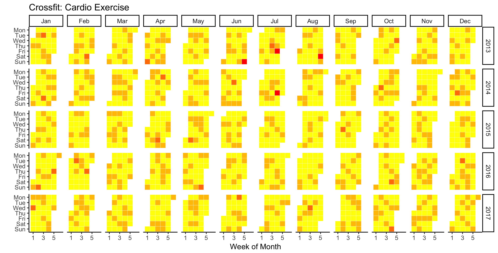

# Crossfit Project: Web-scraping and Text Analytics

Welcome to my Crossfit project!

## Content
* Crossfit.com webscraping
* Data management and cleaning
* **Analysis 1:** Cardio Heatmap

## Crossfit.com webscraping
In the script attached, I built a web-scraper for the crossfit.com daily workouts (Workout of the Day). Be sure to scrape ethically — don't overburden the servers and stay identifiable.

## Data management and cleaning
The script contains some basic data management and cleaning for the scraped text.

## **Analysis 1:** Cardio Heatmap
How often do Crossfiters do cardio? Let us see on the following heatmap. Red color indicates more cardio exercises in the workout.

